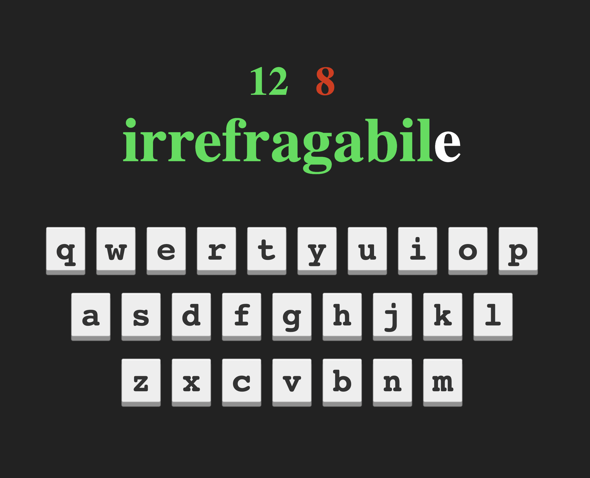

#Frontenders Community

## Challenge #7 - Words Game

In questa challenge dobbiamo creare una web app in cui è presente il layout di una tastiera e una parola da scrivere. 
La web app legge i tasti premuti dal giocatore:
- per ogni lettera corretta aumenta il punteggio di 1, 
- per ogni lettera sbagliata decrementa il punteggio di 1 (o aumenta gli errori di 1)

Man mano che scriviamo la parola, questa viene colorata di verde.
Alla pressione dei tasti da parte del giocatore possiamo associare una piccola animazione sul singolo tasto 
presente nel layout, simulando la pressione dello stesso.

In allegato trovate una schermata del gioco. Su colori e font avete totale libertà.

Bonus:
- Animazione alla pressione di un tasto sbagliato
- Calcolo velocità di scrittura
- Possibilità di scrivere frasi e non solo parole
- Schermata di fine gioco e possibilità di ricominciare

### Preview

